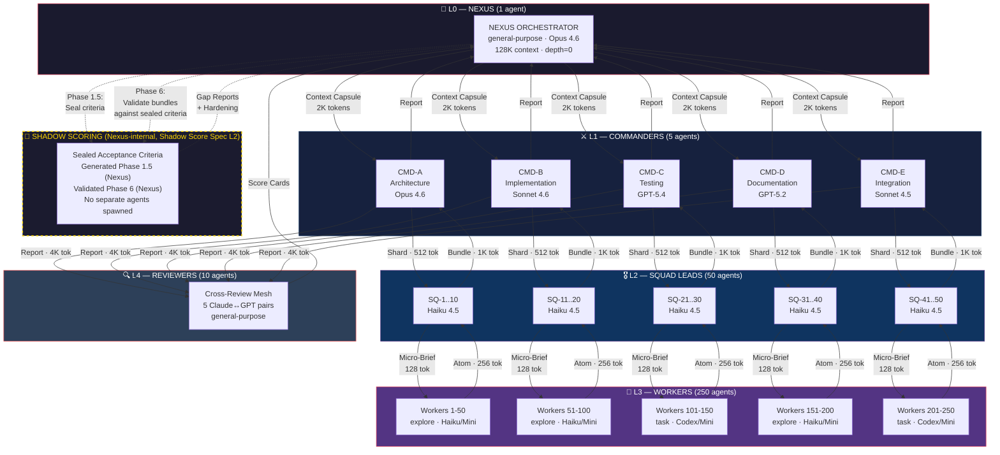
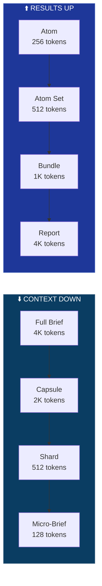
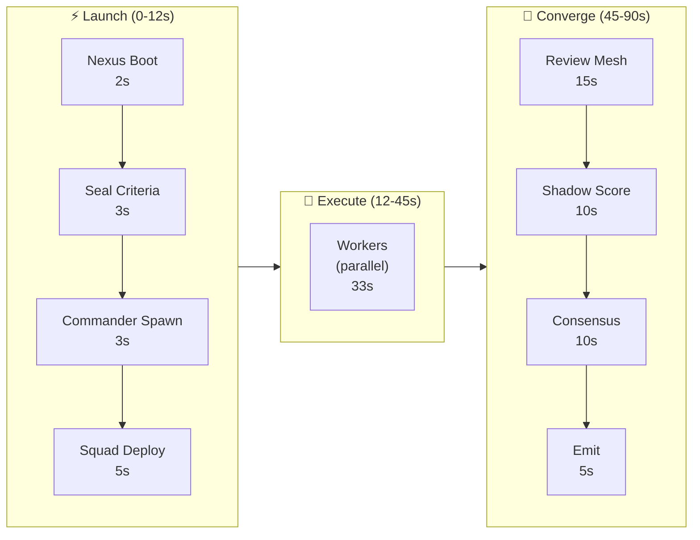
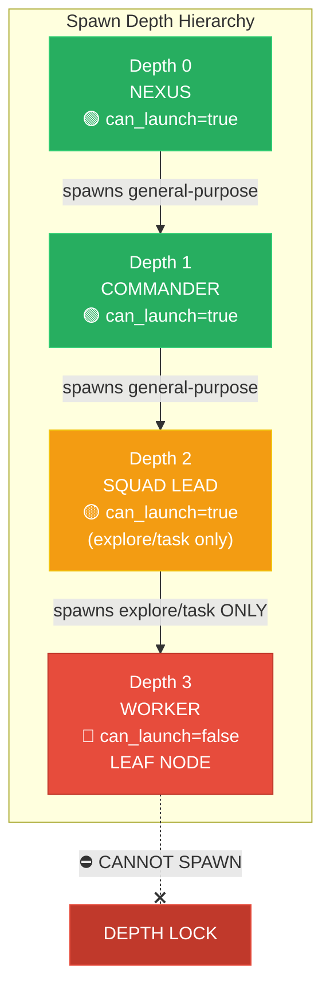
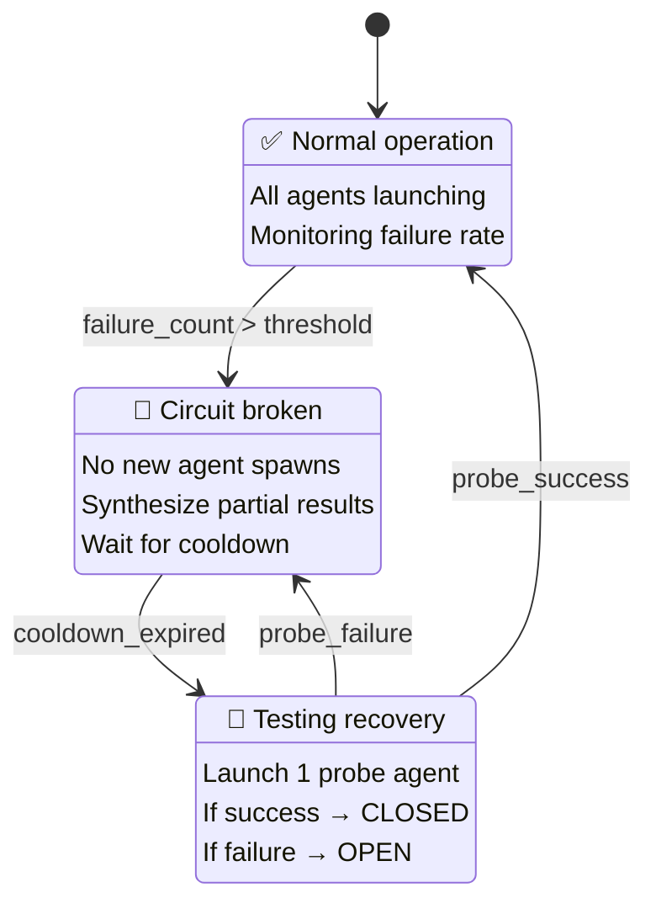
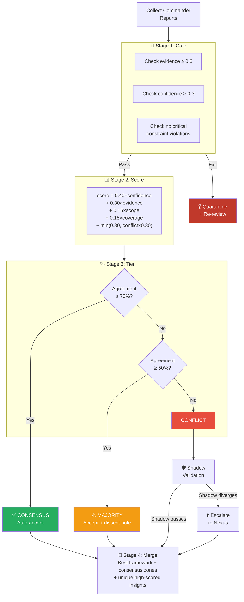
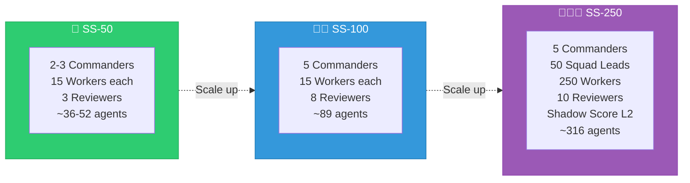

# 🐝 Swarm Command — Architecture Diagrams

## System Overview

## Signal Flow — Token Compression

## Time-Flow Pipeline

## Depth Guard Model

## Circuit Breaker FSM

## Consensus Algorithm Flow

## Scaling Variants

